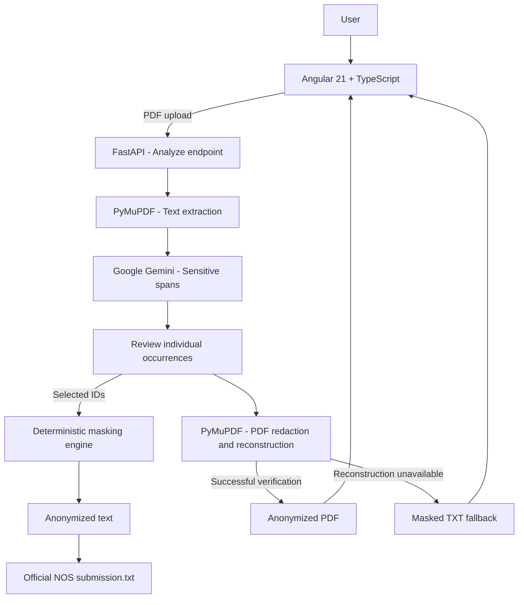

# DataVeil

**AI-powered document anonymization**  
*Protect what matters. Preserve the context.*

Developed by **Team HTTPERROR469** for the **NOS GenAI Challenge — JunctionX Lisbon 2026**.

DataVeil helps users identify, review, and anonymize sensitive information in PDF documents. It combines contextual detection using Google Gemini with deterministic word-level masking and PDF reconstruction, while keeping the original document understandable.

**[Source repository](https://github.com/JJesus158/nos-gen-ai-hackathon)** · **[Backend guide](backend/README.md)** · **[Frontend guide](frontend/README.md)** · **[API contract](frontend/API_CONTRACT.md)**

## 1. Project Overview

### The problem

PDF documents are routinely exchanged for administrative, medical, financial, and professional purposes. They can contain names, identifiers, contact details, and context-dependent sensitive information. Finding and removing that information manually is slow and error-prone. Purely pattern-based approaches also struggle when sensitivity depends on context rather than a fixed format.

### Our solution

**DataVeil** combines two complementary approaches:

- **Context-aware identification:** Gemini identifies potentially sensitive passages and explains their categories.
- **Deterministic anonymization:** Python applies the substitutions, so the language model does not rewrite the entire document or arbitrarily change unrelated text.

For the NOS challenge, the expected textual rule is **one `*` for each anonymized word**, while preserving non-sensitive text and its spacing. For the product demo, DataVeil can also redact the selected words in the source PDF and offer a reconstructed PDF for download.

**Example**

```text
Original:    Nome: Ana Correia | NIF: 123456789
Anonymized:  Nome: * * | NIF: *
```

The application is a **hackathon prototype**, not a guarantee that every possible PDF or hidden data element has been completely sanitized.

## 2. Features & Demo

### User journey

1. **Select a PDF** — Upload a document and inspect its first-page preview.
2. **Analyze** — The backend extracts text and asks Gemini to identify sensitive occurrences.
3. **Review** — Inspect detected occurrences, categories, and explanations; select what to anonymize.
4. **Anonymize** — Only the selected occurrences are replaced in the output.
5. **Compare and download** — Review the original and anonymized text, then download the generated PDF or a safe text fallback.

### Main capabilities

| Capability | Description |
| --- | --- |
| PDF text extraction | PyMuPDF extracts text from paths or in-memory bytes. |
| Contextual detection | Gemini returns structured sensitive-data spans with categories and explanations. |
| Selective review | Select all occurrences, a category, or individual detections before anonymization. |
| Word-level masking | Each sensitive word becomes one `*`; non-selected text is preserved. |
| PDF reconstruction | Sensitive PDF text is redacted and consecutive masked words are rendered together. |
| Metadata cleanup | Standard and XML/XMP metadata are cleared on reconstructed PDF export. |
| Safe download fallback | If the selected PDF cannot be reconstructed consistently, the API returns the masked text as `.txt` instead. |
| Accessible interface | Angular UI with English/Portuguese, light/dark/system appearance, and responsive layout. |

### Demo walkthrough

**Document → Analysis → Anonymization → Results**

A useful demonstration is to upload the sample medical report, inspect the detected entities, deselect one occurrence to show user control, anonymize the selection, and compare the resulting text with the downloadable file.

The supplied example PDF is [`raw_data/document_to_anonymize.pdf`](../raw_data/document_to_anonymize.pdf). The frontend also includes a clearly labeled local example mode; **verify the live API connection when demonstrating real uploads**.

## 3. System Architecture



### Technology stack

| Layer | Technology | Purpose |
| --- | --- | --- |
| Frontend | Angular 21, TypeScript, PDF.js, Bootstrap | Upload, preview, selection, comparison, download |
| API | Python, FastAPI, Pydantic | Validate requests, manage analysis state, serve results |
| AI | Google Gemini via `google-genai` | Contextual identification of sensitive spans |
| PDF engine | PyMuPDF | Extraction, word positioning, redaction, export |
| Quality | pytest, flake8 | Automated regression tests and style checks |
| Deployment | Docker | Build Angular and serve it together with the FastAPI backend |

The app does **not require a database for the MVP**. The API temporarily keeps analyses and the uploaded PDF in a thread-safe in-memory store, with a default **one-hour expiry**. The Docker configuration uses **one worker** so both API requests can access that same store. Do not treat this as durable storage across restarts.

## 4. Technical Implementation

### 4.1 PDF extraction — `anonymizer/extract.py`

`extract_text(path)` accepts `Path` or `str`; `extract_text_from_bytes(data)` processes uploaded PDF bytes without writing a temporary file. Both functions preserve the extracted non-empty lines and spacing within those lines. Complex layouts may have a different extraction order from the visual reading order.

### 4.2 Sensitive-data detection — `anonymizer/detector.py`

The detector supplies numbered document text and the challenge prompt to Gemini. The model responds with structured spans, including the **line**, **text**, **category**, and an optional **reason**. The model identifies candidate information; it does **not** write the final anonymized document.

Supported categories include names, identifiers, contact details, birth dates, financial and health information, and other context-sensitive personal attributes. Detection quality depends on the model output and its agreement with the original document.

### 4.3 Deterministic masking — `anonymizer/masker.py`

The masking engine locates spans in the extracted text and replaces each affected word with exactly one `*`. `mask_with_positions()` also returns the affected word positions and unmatched spans. `runs()` groups consecutive masked words for compact visual presentation in the PDF.

Unmatched spans are reported; they must not silently be interpreted as successfully removed information.

### 4.4 PDF reconstruction — `anonymizer/pdf_reconstructor.py`

The reconstruction module relates masked words to positions in the original PDF. It groups consecutive masked words, applies actual PDF redactions, and inserts the replacement asterisks. The exporter also clears standard and XML metadata.

The compatibility function `reconstruct_pdf(...)` returns PDF bytes. `reconstruct_pdf_with_report(...)` additionally returns unmatched spans so callers can decide whether an export needs review.

**Important:** the reconstructed PDF is intended for visual download. The official NOS text must **not** be generated by re-extracting it: new replacement glyphs may appear in a different internal text order.

### 4.5 Two-stage API — `backend/api/main.py`

| Endpoint | Request | Response |
| --- | --- | --- |
| `POST /api/documents/analyze` | Multipart `file` containing one PDF | Analysis ID, extracted text, detected entity occurrences |
| `POST /api/documents/{analysis_id}/anonymize` | JSON with `selectedEntityIds` | Anonymized text and base64-encoded downloadable PDF or TXT |
| `GET /api/health` | No body | Health status |

The API enforces a **10 MB upload limit**. Each detected occurrence has its own ID so users can choose between repeated values. The download must reflect **the exact selected occurrences**, not an automatically anonymized version of everything.

The API returns a TXT fallback when PDF reconstruction fails or the reconstructed PDF would not protect everything shown in the masked text preview. More detail is available in [`frontend/API_CONTRACT.md`](frontend/API_CONTRACT.md).

## 5. Testing & Security

### Automated testing

From `submission/backend/`:

```bash
python -m pytest -q
python -m flake8 .
```

For the Angular project, from `submission/frontend/`:

```bash
npm test -- --watch=false --browsers=ChromeHeadless
npm run build
```

The backend suite covers extraction, Gemini response parsing and validation, masking, CLI reproducibility, PDF reconstruction, selective API behavior, and error cases. Gemini calls should be mocked or replayed from saved runs during automated tests.

**Last confirmed local checkpoint for PDF reconstruction:** **63 backend tests passed** and the relevant Python files passed flake8. This is a historical checkpoint; update it with the final full-suite result before submission.

### Privacy and safety considerations

- **Real redaction:** removing underlying PDF text is safer than merely drawing a rectangle on top of it.
- **Metadata:** standard and XML/XMP document metadata are cleared during PDF export.
- **Review:** an unmatched span or failed PDF alignment must not be represented as a guaranteed successful redaction.
- **Safe fallback:** when reconstruction is not trustworthy, the API delivers the anonymized text instead.
- **Credentials:** `GEMINI_API_KEY` is a backend secret and must never be committed or exposed to Angular.
- **Storage:** uploaded documents are processed in memory in the MVP, rather than stored in a permanent user database; analyses expire from the in-memory store.
- **External processing:** text sent to Gemini is processed by an external AI provider. Avoid using real confidential documents without suitable authorization and safeguards.

### Known limitations

- Some scanned/image-only PDFs do not have an extractable text layer; full OCR support should not be assumed from the current extraction module.
- Tables, multi-column layouts, graphics, unusual fonts, annotations, embedded files, and metadata outside the standard fields may need additional validation or sanitization.
- Replacement asterisks are appended as new PDF content; re-extracting the resulting PDF may return a different text order even when the visual layout is correct.
- Redaction regions may change the appearance of the original document, especially in tightly spaced or complex layouts.
- Gemini can miss sensitive entities or flag text incorrectly. User review remains important.
- The in-memory store is designed for the hackathon MVP, not multi-worker persistence or high availability.

## 6. Team & Future Work

### Team HTTPERROR469

| Member | GitHub | Contributions |
| --- | --- | --- |
| **João** | [@JoaoPeixoto003](https://github.com/JoaoPeixoto003) | PDF extraction, PDF reconstruction, backend integration |
| **Joel** | [@JJesus158](https://github.com/JJesus158) | Gemini detection, integration and evaluation |
| **Duarte** | [@DuarteSousa24](https://github.com/DuarteSousa24) | Deterministic masking, word positioning and pipeline collaboration |
| **Guilherme** | [@guilhermejmlopes](https://github.com/guilhermejmlopes) | Angular frontend, validation, README and demo |

Actual contributions and reviews are traceable through the repository's commits and Pull Requests.

### Code review rotation

| Author / focus | Reviewer and merge | Alternative |
| --- | --- | --- |
| **A — Joel:** integration and evaluation | C — Duarte | B — João |
| **B — João:** prompt and Gemini | A — Joel | D — Guilherme |
| **C — Duarte:** pipeline and masker | D — Guilherme | A — Joel |
| **D — Guilherme:** validation, README and demo | B — João | C — Duarte |

### Future improvements

- OCR and image-based sensitive-data detection for scanned PDFs.
- Stronger support for tables, mixed layouts, forms, annotations and embedded files.
- Expanded validation of metadata and residual hidden PDF content.
- More precise visual reconstruction of replacement glyphs.
- More robust review and explainability of model detections.
- Persistent, scalable processing and richer audit controls, subject to privacy requirements.


**DataVeil — Protect what matters. Preserve the context.**

*Created for JunctionX Lisbon 2026 — NOS GenAI Challenge.*
